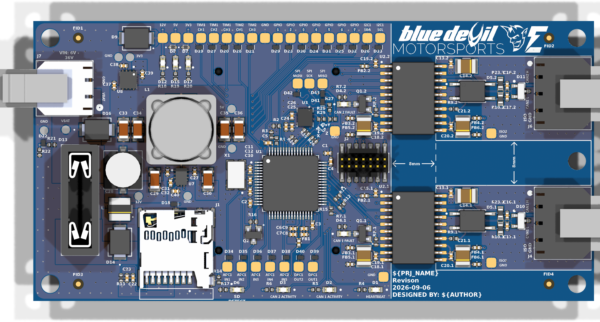
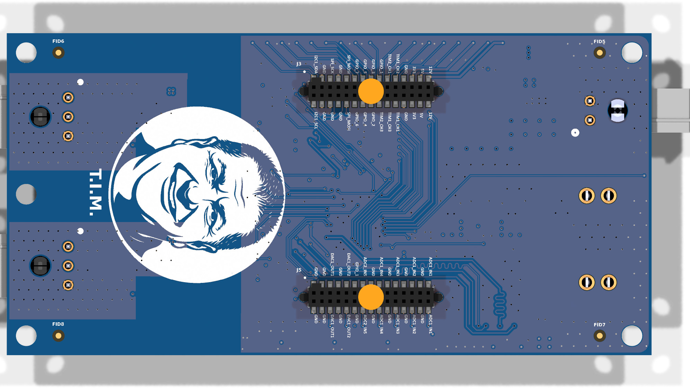
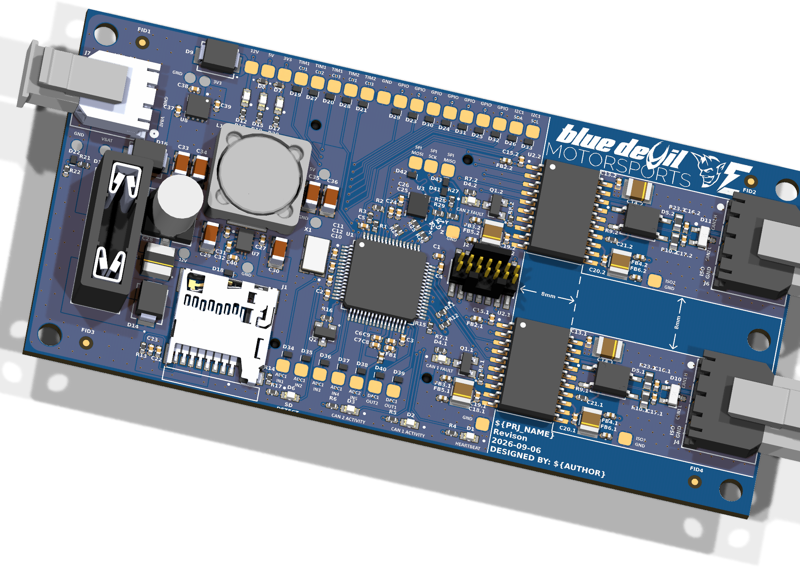
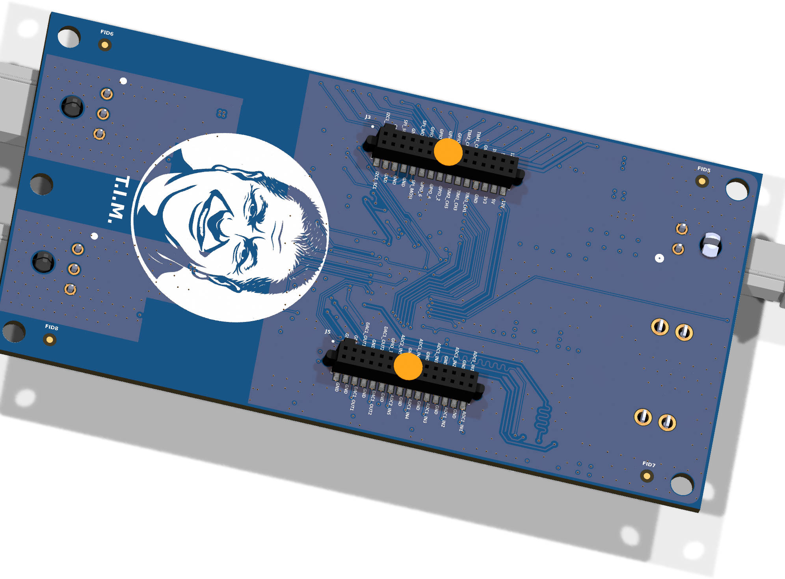

  

<h1 align="center">Board Name</h1>

  

  
&nbsp; &nbsp; &nbsp; &nbsp;
  

***

  
&nbsp; &nbsp; &nbsp; &nbsp;
  

***

## SPECIFICATIONS

| Parameter | Value |
| --- | --- |
| Dimensions | 100.0 × 50.0 mm |

***

## DIRECTORY STRUCTURE

    .
    ├─ 3D                 # STEP 3D model export
    ├─ Computations       # Misc calculations
    ├─ Images             # Pictures and renders
    │
    ├─ kibot_resources    # External resources for KiBot
    │  ├─ colors          # Color theme for KiCad
    │  ├─ fonts           # Fonts used in the project
    │  ├─ scripts         # External scripts used with KiBot
    │  └─ templates       # Templates for KiBot generated reports
    │
    ├─ kibot_yaml         # KiBot YAML config files
    │
    ├─ lib                # KiCad footprint and symbol libraries
    │  ├─ 3d_models       # Component 3D models
    │  ├─ lib_fp          # Footprint libraries
    │  └─ lib_sym         # Symbol libraries
    │
    ├─ Logos              # Logos
    ├─ Reports            # Reports for ERC/DRC
    ├─ Templates          # Title block templates
    │
    └─ Variants           # Outputs for custom (non-standard) variants
